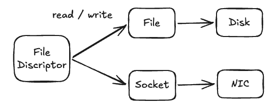
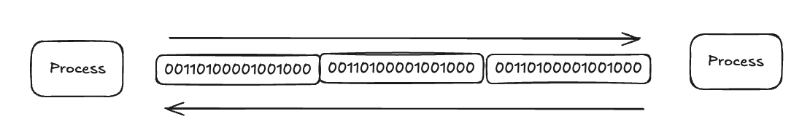
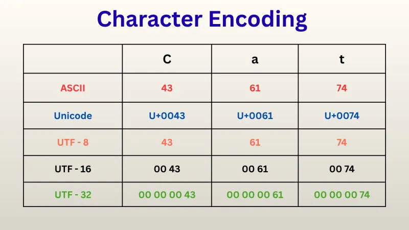

### 들어가며



[지난 글](https://jungmini0601.github.io/hugo-blog/posts/hello-world-1/)에서 우리는 Hello World가 콘솔에 출력되기 위해서 표준 출력을 가르키는 파일디스크립터에게 Write 시스템콜을 넘겨 출력하는 것을 확인 했다. 본격적으로 Go의 I/O를 다루기 전에, 컴퓨터가 데이터를 주고받는 단위와 개념부터 정리하고 넘어가려고한다.

### **바이트(Byte) **



컴퓨터는 세상의 모든 데이터를 0과 1, 즉 비트(bit)로 표현한다. 하지만 1비트 단위로 데이터를 다루기에는 너무 잘아서 비효율적이기 때문에, 보통 8비트를 하나로 묶은 **바이트(byte)** 를 기본 단위로 사용한다. 1바이트는 0~255까지 256가지 값을 표현할 수 있다.

네트워크로 데이터를 전송하든, 파일을 읽고 쓰든, 메모리에 접근하든 대부분의 I/O는 이 바이트 단위로 이루어진다. 즉 우리가 다루는 데이터가 텍스트든 이미지든 영상이든, 가장 아래 계층에서는 결국 바이트의 나열일 뿐이다.

### **바이트 스트림(Byte Stream)**

데이터를 주고받을 때는 크기가 정해진 한 덩어리가 아니라, 어디서 끝날지 알 수 없는 **연속된 바이트의 흐름**으로 다루는 경우가 많다. 이것을 **바이트 스트림(byte stream)** 이라고 부른다.

파일을 읽을 때도, 소켓으로 네트워크 데이터를 받을 때도 결국은 바이트 스트림을 앞에서부터 순차적으로 읽고 쓴다. 스트림 방식의 장점은 전체 데이터를 한 번에 메모리에 올리지 않고 **조금씩 끊어서 처리**할 수 있다는 점이다. 덕분에 용량이 매우 크거나, 길이를 미리 알 수 없는 데이터도 일정한 메모리만으로 안전하게 처리할 수 있다.

### **문자 인코딩(Character Encoding)**



컴퓨터는 오직 바이트만 이해하므로, 사람이 읽는 문자(텍스트)도 결국 바이트로 변환해 저장하고 전송해야 한다. 이때 어떤 문자를 어떤 바이트로 대응시킬 것인가를 정한 규칙이 바로 **문자 인코딩(character encoding)** 이다.

- **ASCII**: 영문 알파벳, 숫자, 기호를 1바이트로 표현하는 가장 기본적인 인코딩.
- **Unicode**: 한글, 한자, 이모지 등 전 세계의 문자를 하나의 체계로 담기 위해 등장한 표준.
- **UTF-8**: 유니코드를 가변 길이 바이트로 인코딩하는 방식으로, 오늘날 가장 널리 쓰인다. 영문은 1바이트, 한글은 보통 3바이트로 표현된다.

여기서 중요한 점은, **바이트 스트림을 읽었다고 해서 그것이 곧바로 "문자"가 되는 것은 아니라는 것**이다. 같은 바이트열이라도 어떤 인코딩으로 해석하느냐에 따라 전혀 다른 문자가 될 수 있고, 인코딩이 어긋나면 글자가 깨지는 현상이 발생한다. 

### 바이트 처리 예제

**문자열 데이터 복사**

```go
func TestStringByteConversion(t *testing.T) {
	s := "Go"
	b := []byte(s) // 복사본 생성
	b[0] = 'N'     // 복사본을 바꿔도

	if s != "Go" { // 원본 string 은 그대로
		t.Fatalf("string 은 불변이어야 한다: %q", s)
	}
}
```

**슬라이스**

```go
// 복사가 아니라 공유
func TestSliceSharesArray(t *testing.T) {
	buf := []byte("hello")
	view := buf[:3] // "hel" — 새 배열이 아니라 같은 배열의 일부

	view[0] = 'H'      // 공유 배열을 수정하면
	if buf[0] != 'H' { // 원본에도 반영된다
		t.Fatalf("슬라이스는 배열을 공유해야 한다: %q", buf)
	}
}
```

**copy**

```go
// 3) copy: 짧은 쪽 길이만큼만 복사하고, 그 개수를 돌려준다.
// io.Reader 가 p 에 데이터를 채울 때 내부적으로 쓰는 동작.
func TestCopy(t *testing.T) {
	dst := make([]byte, 3) // 3칸뿐
	src := []byte("hello") // 5바이트

	n := copy(dst, src) // min(3, 5) = 3 만 복사
	if n != 3 || string(dst) != "hel" {
		t.Fatalf("copy 는 짧은 쪽만큼: n=%d dst=%q", n, dst)
	}
	t.Logf("copy -> n=%d dst=%q (작은 쪽 길이만큼만)", n, dst)
}
```

**append**

```go
// cap 이 남으면 같은 배열을 재사용, 모자라면 새 배열로 옮긴다.
func TestAppendGrow(t *testing.T) {
	buf := make([]byte, 0, 4) // len=0, cap=4
	buf = append(buf, 'a', 'b')

	same := append(buf, 'c') // cap 여유 → 같은 배열 사용
	same[0] = 'X'            // 같은 배열이므로
	if buf[0] != 'X' {       // 원본도 바뀐다
		t.Fatalf("cap 여유 시 배열 공유: buf=%q", buf)
	}
	t.Logf("cap 여유: append 가 배열 재사용 (buf[0]도 'X'로 바뀜)")

	// cap 을 넘기면 새 배열로 분리된다.
	grow := make([]byte, 0, 1)
	grow = append(grow, '1')
	moved := append(grow, '2') // cap 초과 → 새 배열
	moved[0] = '9'
	if grow[0] == '9' {
		t.Fatal("cap 초과 시 새 배열로 분리되어야 한다")
	}
	t.Logf("cap 초과: append 가 새 배열 생성 (원본과 분리)")
}
```

다음 글에서는 I/O를 효율적으로 다루기 위한 버퍼링, copy 최적화에 대해 알아보겠다.
