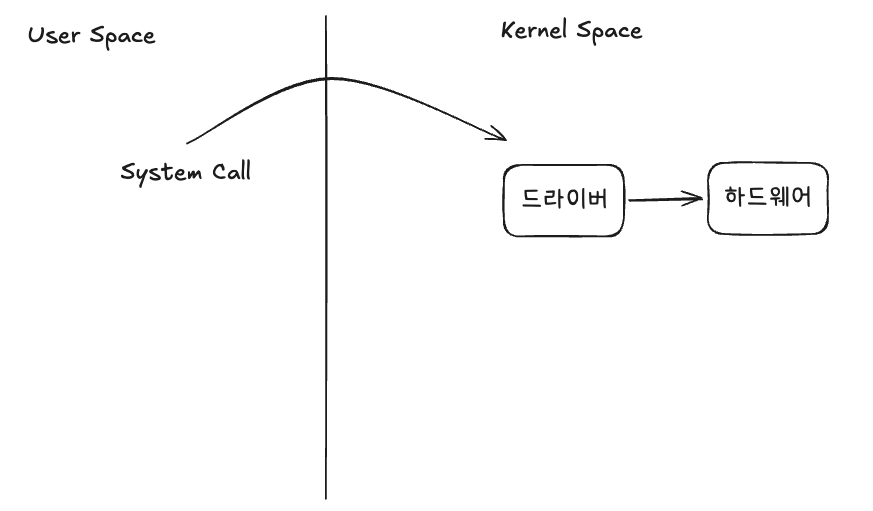
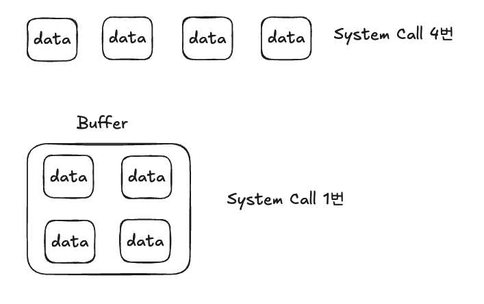

### I/O가 생기면 발생하는 일



우리가 `Write()` 호출하면 아래와 같은 과정이 일어납니다.

1. **유저 모드에서 호출**: 애플리케이션 코드는 평소 유저 모드(user mode)에서 실행됩니다. `Write()`를 호출하면 라이브러리가 syscall을 요청할 준비를 합니다.
2. **유저 모드 → 커널 모드 전환 **: syscall이 트리거되면 CPU가 권한 수준을 높여 커널 모드로 전환합니다. 
3. **하드웨어로 전환**: 커널이 디바이스 드라이버를 통해 디스크 컨트롤러나 NIC 같은 실제 하드웨어에 작업을 지시합니다. 물리 장치가 동작하는 이 구간은 CPU 연산에 비해 훨씬 느립니다.
4. **다시 커널 → 유저 모드 복귀**: 처리가 끝나면 결과를 들고 커널 모드에서 유저 모드로 되돌아오며, 또 한 번 모드 전환 비용이 듭니다.

여기서 핵심은, **데이터가 크든 작든 이 전환 과정 자체가 매번 고정적으로 발생**한다는 점입니다. 그래서 작은 데이터를 여러 번 쓰면, 정작 옮기는 데이터는 얼마 안 되는데 유저 ↔ 커널 ↔ 하드웨어를 오가는 왕복 비용만 쌓이게 됩니다. 

### Buffer



앞서 본 것처럼, 작은 데이터를 쓸 때마다 매번 유저 ↔ 커널 ↔ 하드웨어를 오가는 전환 비용이 고정적으로 발생합니다. 데이터를 1바이트씩 1만 번 보내든 한 번에 모아서 보내든 옮기는 총량은 같은데도, 전환 횟수에 따라 비용이 크게 달라집니다.

이러한 비효율을 개선하기 위해 등장한 개념이 바로 **버퍼**입니다. 매번 하위로 내려보내는 대신, 데이터를 일단 메모리의 임시 저장 공간(버퍼)에 모아두었다가, 충분히 쌓였을 때 한 번에 내려보내자는 발상입니다. 작은 쓰기 여러 번을 큰 쓰기 한 번으로 합치면, 옮기는 데이터량은 그대로이면서 비싼 전환 횟수만 크게 줄일 수 있습니다.

## countingWriter

```go
// countingWriter: Write 가 몇 번 호출됐는지 센다.
// 각 Write 호출을 "syscall 1회"의 프록시로 본다 (실제 os.File 이면 진짜 syscall).
type countingWriter struct {
	calls int
	bytes int
}

func (c *countingWriter) Write(p []byte) (int, error) {
	c.calls++
	c.bytes += len(p)
	return len(p), nil
}
```

먼저, Write가 몇 번 불렸는지를 세는 작은 Writer를 만듭니다. 여기서 `calls`는 Write가 몇 번 호출됐는지를 세는 값입니다.

## 버퍼가 없는 경우

```go
const (
	chunk = "log-line-entry\n" // 15바이트
	iters = 10000
)

// 버퍼링 없음: 1만 번 쓰면 1만 번 호출
raw := &countingWriter{}
for i := 0; i < iters; i++ {
	io.WriteString(raw, chunk)
}
```

버퍼가 없으니 `io.WriteString` → `raw.Write`가 **매번** 호출됩니다. 결과적으로 `raw.calls == 10000` 이 되고, 실제로 파일에 데이터를 쓰게 되면 1만 번의 시스템 콜을 호출하게 됩니다.

## 버퍼가 있으면

```go
// 버퍼링: 4KB 버퍼가 찰 때만 하위 Write 호출
counted := &countingWriter{}
bw := bufio.NewWriterSize(counted, 4096)
for i := 0; i < iters; i++ {
	io.WriteString(bw, chunk)
}
bw.Flush() // ← 잊으면 남은 데이터 유실!
```

`bw`는 내부에 4096바이트 버퍼를 가집니다.

- `io.WriteString(bw, chunk)`는 대부분의 경우 바로 하위 `Write`를 부르지 않습니다.
- 대신 `chunk`를 버퍼 메모리에 **복사해 누적**합니다.
- 버퍼가 꽉 차는 순간(또는 `Flush` 시점)에만, 누적된 데이터를 **한 덩어리로** `counted.Write`에 넘깁니다.

대략 계산해 보면, 총 데이터는 `15 × 10000 = 150,000`바이트이고 버퍼가 4096바이트이므로 하위 호출은 `150,000 / 4096 ≈ 37`회 수준입니다. **1만 번이 수십 번으로** 줄어듭니다.

## Flush

버퍼드 스트림에는 아직 하위로 내려보내지 않은 데이터가 메모리에 남아 있을 수 있습니다. 그래서 마지막에 반드시 비워 줘야 합니다.

```go
bw.Flush()
```

`Flush`는 지금 버퍼에 쌓인 내용을 강제로 하위 Writer로 내보내라는 의미입니다. 프로그램이 종료되면 메모리 버퍼는 그냥 사라지므로, `Flush` 없이 끝나면 **마지막에 남은 데이터가 실제 목적지(파일/네트워크)에 도달하지 못하고 유실**됩니다.

## 버퍼 크기는 항상 클수록 좋은가?

아닙니다. 버퍼 크기는 워크로드에 따라 측정해서 정해야 하는 **튜닝 대상**입니다.

```go
func BenchmarkUnbuffered(b *testing.B) {
	w := &countingWriter{}
	b.ReportAllocs()
	for i := 0; i < b.N; i++ {
		io.WriteString(w, chunk)
	}
}

func BenchmarkBuffered4KB(b *testing.B) {
	bw := bufio.NewWriterSize(&countingWriter{}, 4096)
	b.ReportAllocs()
	for i := 0; i < b.N; i++ {
		io.WriteString(bw, chunk)
	}
	bw.Flush()
}

func BenchmarkBuffered64KB(b *testing.B) {
	bw := bufio.NewWriterSize(&countingWriter{}, 64*1024)
	b.ReportAllocs()
	for i := 0; i < b.N; i++ {
		io.WriteString(bw, chunk)
	}
	bw.Flush()
}
```

버퍼를 키운다고 무조건 빨라지지 않는 이유는 다음과 같습니다.

- 버퍼가 커질수록 메모리 사용량이 늘어난다.
- 너무 큰 버퍼는 CPU 캐시 측면에서 손해가 될 수 있다.
- 하위 시스템(디스크, 네트워크, OS 버퍼링)과의 궁합이 존재한다.

## 정리

버퍼드 스트림은 **작은 I/O를 모아 큰 I/O로 합쳐** `Write()`/syscall 호출 횟수를 줄이고, 커널·디스크·네트워크 경로의 비싼 오버헤드를 절감해 **처리량을 높이고 지연을 줄이기 위해** 사용합니다. 단, 버퍼에 남은 데이터를 `Flush`로 반드시 비워야 하며, 버퍼 크기는 워크로드에 맞춰 측정으로 정해야 합니다.
