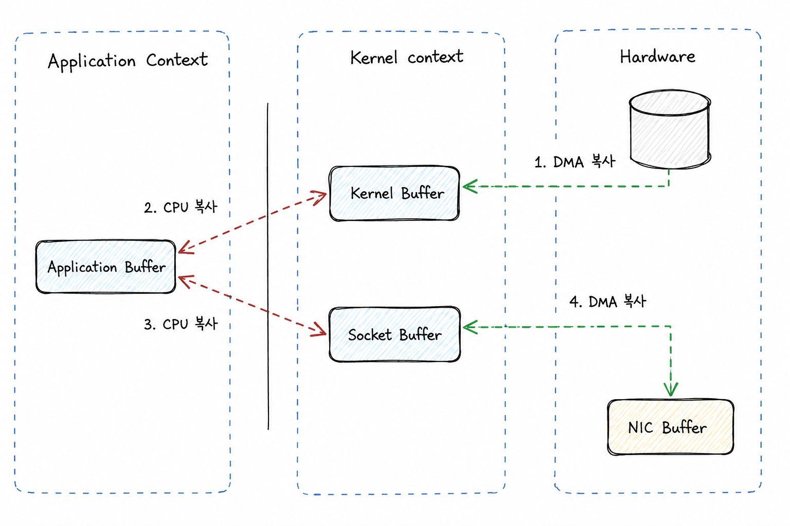
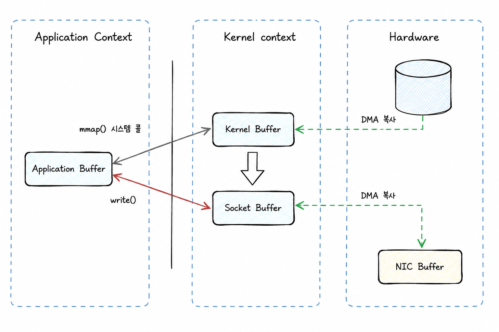
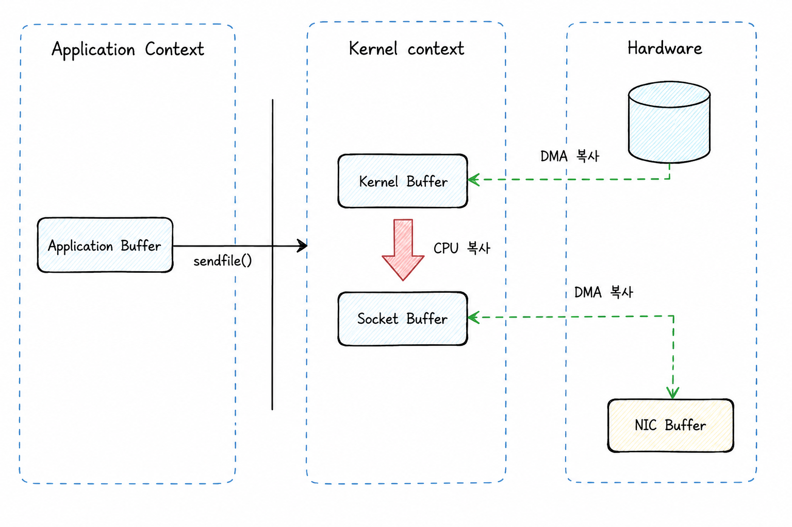

### io.Copy란?

`io.Copy(dst, src)`는 Go의 `io` 패키지에서 제공하는 **범용 스트림 복사 함수**입니다. `src`데이터를 읽어 `dst`로 그대로 흘려보내며, 파일/네트워크/메모리 등 **어떤 I/O든 동일한 인터페이스로 처리**할 수 있게 해줍니다.

함수 시그니처는 다음과 같습니다.

```go
func Copy(dst Writer, src Reader) (written int64, err error)
```

- `src`는 `io.Reader`
- `dst`는 `io.Writer`
- 반환값 `written`은 실제로 쓴 바이트 수(성공적으로 `dst`에 기록된 바이트 수)
- `err`는 복사 중 발생한 에러(단, `src`에서 EOF는 정상 종료로 취급)

Go에서는 파일, 네트워크 소켓, HTTP 바디, 버퍼 등이 모두 `io.Reader`/`io.Writer`로 추상화됩니다. 그래서 `io.Copy` 하나만 알면 다음을 같은 방식으로 처리할 수 있습니다.

- 파일 → 파일 복사
- HTTP 요청 바디 → 파일로 저장
- 파일 → HTTP 응답으로 스트리밍
- 압축/암호화 스트림을 끼워 넣어 파이프라인 구성

### 동작 방식

`io.Copy`는 내부적으로 일정 크기의 버퍼를 사용해 반복적으로 다음을 수행합니다.

1. `src.Read(buf)`로 읽고
2. 읽은 만큼 `dst.Write(buf[:n])`로 쓰고
3. EOF가 나오면 종료

### 파일 복사

```go
package main

import (
	"io"
	"os"
)

func main() {
	src, err := os.Open("input.txt")
	if err != nil {
		panic(err)
	}
	defer src.Close()

	dst, err := os.Create("output.txt")
	if err != nil {
		panic(err)
	}
	defer dst.Close()

	written, err := io.Copy(dst, src) // 스트리밍이기 때문에 전체를 메모리에 올리지 않음
	if err != nil {
		panic(err)
	}

	_ = written // 복사된 바이트 수
}
```

### HTTP에서 자주 보게 되는 패턴

```go
func saveUpload(r *http.Request, path string) error {
	f, err := os.Create(path)
	if err != nil {
		return err
	}
	defer f.Close()

	_, err = io.Copy(f, r.Body)
	return err
}
```

```go
func download(w http.ResponseWriter, r *http.Request) {
	f, err := os.Open("video.mp4")
	if err != nil {
		http.Error(w, "not found", http.StatusNotFound)
		return
	}
	defer f.Close()

	w.Header().Set("Content-Type", "video/mp4")
	_, _ = io.Copy(w, f)
}
```

### WriterTo / ReaderFrom — 인터페이스 기반 최적화

`io.Copy`는 `dst Writer`와 `src Reader`라는 **인터페이스**만 받습니다. 그래서 기본 동작은 버퍼에 `Read` → `Write`를 반복하는 루프이지만, 전달된 구체 타입이 더 빠른 복사 방법을 알고 있다면 그 방법에 위임할 수 있습니다.

`io.Copy`는 내부에서 다음 순서로 더 빠른 경로가 있는지 확인합니다.

1. `src`가 `io.WriterTo`를 구현하면 → `src.WriteTo(dst)`에 위임
2. `dst`가 `io.ReaderFrom`을 구현하면 → `dst.ReadFrom(src)`에 위임
3. 둘 다 없으면 → 기본 버퍼 복사 루프 사용

이처럼 타입이 `WriteTo`/`ReadFrom`을 직접 구현해 두면, `io.Copy`는 중간 버퍼를 거치는 일반 루프 대신 그 구현을 호출합니다. 바로 이 지점에서 **유저 공간 버퍼를 거치지 않는 제로 카피(zero-copy)** 같은 메커니즘을 구현할 수 있습니다.

대표적인 예가 `os.File`입니다. 리눅스에서 파일→소켓 복사처럼 조건이 맞으면, 데이터를 유저 공간으로 한 번 읽었다가 다시 쓰는 대신 커널 내부에서 곳바로 전송하는 `sendfile(2)` 같은 시스템 콜로 처리될 수 있습니다. 데이터가 유저 공간을 왕복하지 않으므로 복사 비용과 컨텍스트 전환이 줄어, 단순 `Read`/`Write` 루프보다 훨씬 빠릅니다.

### 제로 카피(Zero-Copy)란?

앞에서 `os.File`이 조건이 맞으면 `sendfile(2)` 같은 시스템 콜로 처리될 수 있다고 했는데, 그 배경이 되는 개념이 바로 **제로 카피(Zero-Copy)**입니다. 제로 카피는 CPU가 한 메모리 영역에서 다른 메모리 영역으로 데이터를 복사하는 작업을 수행하지 않는 것을 말합니다. 즉, OS 커널과 사용자 애플리케이션 주소 공간 사이의 데이터 복사를 줄이거나 완전히 제거해, **사용자-커널 간 컨텍스트 스위칭 오버헤드와 CPU 복사 비용을 줄이는** 기법입니다.

인터럽트가 CPU의 대기 시간을 줄이고 DMA가 CPU의 직접 전송 부담을 줄여주지만, 그래도 여전히 **커널 공간(Kernel Space)과 사용자 공간(User Space) 사이의 데이터 복사**라는 비효율이 남습니다. 이 복사를 제거하려는 것이 제로 카피의 핵심 동기입니다. 대표적인 구현으로 `mmap()`과 `sendfile()` 시스템 콜이 있습니다.

비교의 출발점이 되는 전통적인 `read()` + `write()` 전송 방식은, 커널↔유저 공간을 오가며 **DMA 복사 2회 + CPU 복사 2회(총 4회)**가 발생합니다.



`mmap()`은 파일 내용을 프로세스의 가상 주소 공간에 매핑해, 이후 파일 데이터를 메모리처럼(포인터 접근으로) 다룰 수 있게 해주는 **시스템 콜**입니다. 여기서 주의할 점이 두 가지 있습니다.

- **시스템 콜이 사라지는 게 아닙니다.** `mmap()` 자체가 시스템 콜이며, 매핑을 설정할 때 호출됩니다. `mmap`이 줄여주는 것은 데이터를 다룰 때마다 반복되는 `read()`/`write()` 시스템 콜이지, 시스템 콜을 완전히 없애는 것이 아닙니다. 또한 매핑한 주소에 처음 접근하면 **페이지 폴트(page fault)**가 발생하고, 그때 커널이 디스크 데이터를 페이지 캐시로 올린 뒤 페이지 테이블에 연결합니다.
- **하드웨어를 직접 접근하는 게 아닙니다.** `mmap`은 페이지 캐시에 올라온 물리 페이지를 프로세스의 가상 주소 공간에 연결하는 것입니다. 덕분에 "디스크 → 유저 버퍼"로의 **CPU 복사 1회가 생략**되어, 유저 공간이 페이지 캐시를 별도 사본 없이 들여다보는 형태가 됩니다. 실제 디스크↔메모리 전송은 여전히 커널과 DMA가 담당합니다.

정리하면 `mmap`이 빠른 이유는 "시스템 콜·복사가 전혀 없어서"가 아니라, **반복되는 I/O 시스템 콜과 유저 공간으로의 복사를 줄여주기 때문**입니다. 다만 매핑한 데이터를 네트워크로 보내려면(예: 소켓 전송) 여전히 `write` 시스템 콜이 필요합니다.



`sendfile()`은 리눅스 커널 2.2에서 도입된 시스템 콜로, **파일 데이터를 사용자 공간을 거치지 않고 소켓으로 직접 전송**하도록 설계되었습니다.

```c
#include <sys/sendfile.h>

ssize_t sendfile(int out_fd, int in_fd, off_t *offset, size_t count);
```

내부적으로는 파일 데이터를 커널의 페이지 캐시(Page Cache)에 적재한 뒤, 해당 페이지들을 소켓 버퍼로 복사하고, DMA를 통해 NIC로 전송합니다. 전체 흐름은 다음과 같습니다.

1. 사용자 프로세스가 `sendfile()`을 호출하여 유저 모드 → 커널 모드 진입 (컨텍스트 스위칭 1회)
2. DMA 컨트롤러가 디스크에서 페이지 캐시(Kernel Buffer)로 복사 (DMA 복사 1회)
3. CPU가 페이지 캐시에서 소켓 버퍼로 복사 (CPU 복사 1회)
4. DMA 컨트롤러가 소켓 버퍼에서 NIC로 복사하여 전송 완료 (DMA 복사 1회)
5. `sendfile()`이 반환되고 커널 모드 → 유저 모드 전환 (컨텍스트 스위칭 1회)

결과적으로 `mmap()+write()`과 동일하게 DMA 복사 2회 + CPU 복사 1회가 발생하지만, **시스템 콜이 하나뿐이라 컨텍스트 스위칭이 2회로 줄어** 더 효율적입니다.

기본 `sendfile()`도 여전히 페이지 캐시 → 소켓 버퍼 복사를 CPU가 수행하므로 **완전한 zero-copy는 아닙니다**. 이 CPU 복사마저 제거하기 위해, 리눅스는 커널 2.4부터 **DMA Scatter/Gather** 기능을 도입했습니다. 페이지 캐시에 흩어진 여러 메모리 조각을 하나의 전송 단위로 묶어, 소켓 버퍼를 거치지 않고 NIC로 바로 보낼 수 있게 됩니다.

1. 사용자 프로세스가 `sendfile()` 호출로 유저 모드 → 커널 모드 진입 (컨텍스트 스위칭 1회)
2. DMA 컨트롤러가 디스크에서 페이지 캐시로 복사 (DMA 복사 1회)
3. 커널이 각 데이터 블록의 주소·크기를 담은 디스크립터(Descriptor Table)를 생성해 NIC에 전달 (CPU가 수행하지만 복사는 없음)
4. NIC가 Scatter/Gather DMA로 페이지 캐시의 데이터를 직접 수집(Gather)해 네트워크 패킷으로 전송 완료 (DMA 복사 1회)
5. `sendfile()`이 반환되고 커널 모드 → 유저 모드 전환 (컨텍스트 스위칭 1회)



### 주의할 점(실무에서 자주 만나는 함정)

1) **에러 처리**

- `io.Copy`의 에러를 무시하면 데이터 손상/부분 전송을 놓칠 수 있습니다.

2) **부분 쓰기(Short Write)**

- `Write`는 항상 요청한 만큼 쓰지 않을 수 있습니다. 직접 루프를 짜면 이 처리를 빠뜨리기 쉬운데, `io.Copy`는 이를 고려합니다.

3) **리소스 종료**

- `io.Copy` 자체는 `Close()`를 호출하지 않습니다. 파일/네트워크 연결은 반드시 닫아야 합니다.

4) **무한 스트림**

- `src`가 끝나지 않는 스트림이면(`tail -f` 같은 입력, 지속 연결 등) `io.Copy`도 끝나지 않습니다. 이런 경우 컨텍스트 취소/타임아웃 설계가 필요합니다.

---

### 한 줄 요약

`io.Copy`는 Go의 I/O 철학(Reader/Writer 추상화)을 가장 잘 보여주는 함수로, **큰 데이터를 스트리밍으로 안전하고 간단하게 복사**할 때 표준적으로 사용합니다.
